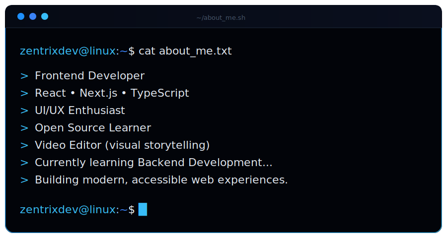

<a id="top"></a>

<div align="center">




<br/>


<h1>Hi there, I'm <code>Zentrix-Dev</code> </h1>


<br/>


<a href="https://github.com/Zentrix-Dev?tab=followers"></a>

<a href="https://github.com/Zentrix-Dev?tab=repositories"></a>
<a href="https://github.com/Zentrix-Dev?tab=stars"></a>


</div>




<div align="center">

</div>


## 🤖 About Me

<table>
<td width="45%" valign="left">

- 🖥️ **Daily driver:** Linux
- 🧠 **Currently learning:** Node.js, Express, REST APIs
- 🎯 **2026 focus:** shipping full-stack side projects
- 🤝 **Open to:** frontend collaborations & open source
- 💬 **Ask me about:** React, Next.js, TypeScript, Tailwind
- 🎬 **Side hobby:** video editing & motion design
- ⚡ **Fun fact:** my terminal theme is bluer than my mood board
- 🌱 **Long-term goal:** end-to-end full-stack products

</td>
</tr>
</table>


## 🚀 Current Focus

<div align="center">

| 🔭 Building | 🌱 Learning | 🤝 Collaborating | 📫 Reach |
|:---:|:---:|:---:|:---:|
| Modern React & Next.js interfaces | Backend dev with Node.js & Express | Open source frontend issues | See [Connect](#connect-with-me) section |
| Accessible, motion-rich UIs | REST API design & data modeling | First-time contributor friendly | `hello@zentrixdev.dev` |
| Design systems in Tailwind | Database basics (Postgres) | Hackathon teams | [linkedin.com/in/zentrix-dev](https://www.linkedin.com/in/zentrix-dev) |

</div>


## 🛠️ Tech Stack

<div align="center">

**Frontend**


<br/><br/>

**Backend & Learning**


<br/><br/>

**Tools & Environment**


<br/><br/>

**Currently Exploring**


</div>


## 📌 Featured Projects

<div align="center">

> _Pin your real repositories below — each card follows the same `github-readme-stats` pin format, themed to match this profile._

<br/>

<a href="https://github.com/Zentrix-Dev">

</a>
<a href="https://github.com/Zentrix-Dev">

</a>

<a href="https://github.com/Zentrix-Dev">

</a>
<a href="https://github.com/Zentrix-Dev">

</a>

<br/>

<sub>Replace <code>REPO_1</code> … <code>REPO_4</code> with the names of repos you want to showcase. Use the snippet below for each card:</sub>

```md
<a href="https://github.com/Zentrix-Dev/REPO_NAME">

</a>
```

</div>


##  GitHub Stats

<div align="center">

<picture>
  <source media="(prefers-color-scheme: dark)" srcset="https://github-readme-stats.vercel.app/api?username=Zentrix-Dev&show_icons=true&theme=tokyonight&hide_border=true&bg_color=0A0F1E&title_color=38BDF8&text_color=93C5FD&icon_color=1E90FF&count_private=true&include_all_commits=true" />
  <source media="(prefers-color-scheme: light)" srcset="https://github-readme-stats.vercel.app/api?username=Zentrix-Dev&show_icons=true&theme=default&hide_border=true&bg_color=FFFFFF&title_color=1E90FF&text_color=0A0F1E&icon_color=38BDF8&count_private=true&include_all_commits=true" />
  
</picture>

<picture>
  <source media="(prefers-color-scheme: dark)" srcset="https://github-readme-stats.vercel.app/api/top-langs/?username=Zentrix-Dev&layout=compact&theme=tokyonight&hide_border=true&bg_color=0A0F1E&title_color=38BDF8&text_color=93C5FD" />
  <source media="(prefers-color-scheme: light)" srcset="https://github-readme-stats.vercel.app/api/top-langs/?username=Zentrix-Dev&layout=compact&theme=default&hide_border=true&bg_color=FFFFFF&title_color=1E90FF&text_color=0A0F1E" />
  
</picture>

<br/><br/>

<picture>
  <source media="(prefers-color-scheme: dark)" srcset="https://streak-stats.demolab.com?user=Zentrix-Dev&theme=tokyonight&hide_border=true&background=0A0F1E&stroke=1E90FF&ring=38BDF8&fire=00BFFF&currStreakLabel=38BDF8&sideLabels=93C5FD&dates=475569" />
  <source media="(prefers-color-scheme: light)" srcset="https://streak-stats.demolab.com?user=Zentrix-Dev&theme=default&hide_border=true&background=FFFFFF&stroke=1E90FF&ring=38BDF8&fire=00BFFF&currStreakLabel=38BDF8&sideLabels=0A0F1E&dates=475569" />
  
</picture>

<br/><br/>

<picture>
  <source media="(prefers-color-scheme: dark)" srcset="https://github-readme-activity-graph.vercel.app/graph?username=Zentrix-Dev&theme=tokyo-night&hide_border=true&bg_color=0A0F1E&color=38BDF8&line=1E90FF&point=00BFFF&area=true&area_color=38BDF8" />
  <source media="(prefers-color-scheme: light)" srcset="https://github-readme-activity-graph.vercel.app/graph?username=Zentrix-Dev&theme=github&hide_border=true&bg_color=FFFFFF&color=1E90FF&line=38BDF8&point=00BFFF&area=true&area_color=38BDF8" />
  
</picture>

<br/><br/>


</div>


## 🐍 Contribution Snake

<div align="center">

<picture>
  <source media="(prefers-color-scheme: dark)" srcset="resources/images/github-contribution-grid-snake-dark.svg" />
  
</picture>

<sub>Generated automatically by <code>.github/workflows/snake.yml</code> on every push to <code>main</code> and daily at 00:00 UTC.</sub>

</div>


## 📚 Learning Roadmap

<div align="center">

| Phase | Focus | Status |
|:---:|:---|:---:|
| ✅ | **Frontend Foundations** — HTML, CSS, JavaScript, responsive design, accessibility | Done |
| ✅ | **Modern Frontend** — React, Next.js, TypeScript, Tailwind, component patterns | Done |
| 🔄 | **Backend Basics** — Node.js, Express, REST APIs, auth, request lifecycle | In progress |
| ⏳ | **Databases** — Postgres, MongoDB, schema design, basic query optimization | Next |
| ⏳ | **Full-Stack Integration** — connecting frontend to real backends, deployment | Next |
| ⏳ | **DevOps Essentials** — Docker, CI/CD, monitoring, basic cloud deploy | Later |

```mermaid
graph LR
  A[Frontend Foundations] --> B[Modern Frontend]
  B --> C[Backend Basics]
  C --> D[Databases]
  D --> E[Full-Stack Integration]
  E --> F[DevOps Essentials]
  style A fill:#0A0F1E,stroke:#38BDF8,stroke-width:2px,color:#93C5FD
  style B fill:#0A0F1E,stroke:#38BDF8,stroke-width:2px,color:#93C5FD
  style C fill:#0A0F1E,stroke:#00BFFF,stroke-width:3px,color:#38BDF8
  style D fill:#0A0F1E,stroke:#1E90FF,stroke-width:2px,color:#475569
  style E fill:#0A0F1E,stroke:#1E90FF,stroke-width:2px,color:#475569
  style F fill:#0A0F1E,stroke:#1E90FF,stroke-width:2px,color:#475569
```

</div>

<br/>

<div align="center">



</div>


## 💬 Dev Quote

<div align="center">


</div>


##  Support

<div align="center">

<sub>If you found my work helpful, consider starring a repo or buying me a coffee — every bit fuels late-night side projects.</sub>

<br/><br/>

<a href="https://ko-fi.com/zentrixdev">

</a>
<a href="https://www.buymeacoffee.com/zentrixdev">

</a>
<a href="https://github.com/sponsors/Zentrix-Dev">

</a>

</div>


##  Connect With Me

<div align="center">

<a href="https://github.com/Zentrix-Dev">

</a>
<a href="https://www.linkedin.com/in/zentrix-dev">

</a>
<a href="https://x.com/zentrixdev">

</a>
<a href="https://www.instagram.com/zentrixdev/">

</a>
<a href="https://dev.to/zentrixdev">

</a>
<a href="mailto:hello@zentrixdev.dev">

</a>

<br/><br/>

<sub>Update the links above with your real profiles before publishing. Replace <code>zentrixdev</code> with your actual handles on each platform.</sub>

</div>


<div align="center">
<sub>Designed and built by <b>Zentrix-Dev</b> — Modern Linux · Blue Cyber · Minimal</sub>
<br/>
<a href="#top"></a>
</div>
